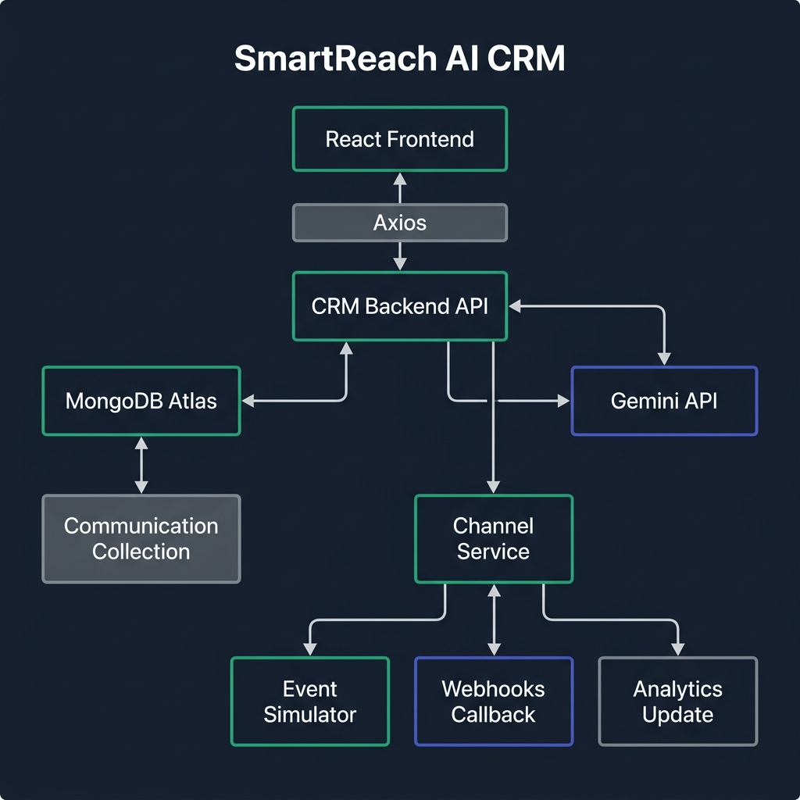

# SmartReach AI CRM - React Frontend Client

This repository contains the single-page React frontend application for **SmartReach AI CRM**, built using Vite, Tailwind CSS (v4), and Recharts. It provides growth marketers with a dashboard to ingest D2C customer data, segment cohorts in natural language, draft personalized campaigns, and track real-time conversion metrics.

---

## Problem Statement

D2C growth marketers struggle with traditional CRM platforms that require:
1. Writing SQL queries or building complex filter trees to construct simple segmentation rules.
2. Manually copywriting versions of the same message for different platforms (SMS, email, WhatsApp, RCS).
3. Interpreting raw JSON delivery logs or static spreadsheets rather than visualizing clean conversion funnel stages.

---

## Product Overview

SmartReach AI CRM offers a clean, visual interface to:
1. **Manage and Sync Shopper Records**: Drag-and-drop CSV uploaders for both shopper profiles and historical orders.
2. **Translate Marketing Intent**: An AI segment builder where typing natural language returns a preview list of matching shoppers and outputs the equivalent MongoDB query.
3. **Automate Channel Copywriting**: An AI copywriter that drafts template variants for multiple channels and suggests the best option.
4. **Visualize Funnel Conversions**: Real-time charts showing falloff rates (Sent ➔ Delivered ➔ Opened ➔ Clicked ➔ Converted) along with AI-generated recommendations.

---

## Demo

- **Hosted Frontend Application**: `https://smartreach-crm.vercel.app` (Example URL)
- **Walkthrough Video**: [Insert walkthrough video URL here]

---

## Architecture

The frontend is a React single-page application (SPA) that communicates with a decoupled CRM API server. It is styled with Tailwind CSS (v4) and uses custom micro-interactions:



### Frontend Architecture Details:
- **Vite Bundler**: Hot-reloading module bundler for fast local development.
- **Client-Side Segment Storage**: Cohort segments are saved to `localStorage`, allowing the marketer to select saved rules inside the Campaign Studio.
- **Visual Analytics**: Interactive Recharts components (Bar charts, Progress bars) visualize conversions.

---

## Features

- **In-Memory CSV Uploader**: Ingest customer demographics and order lists directly from the browser.
- **Responsive Layout**: Uses a modern glassmorphic design system that adjusts seamlessly to mobile and desktop screens.
- **Dynamic Previews**: Previews query results as you write prompts.
- **One-click Template Application**: Apply AI-generated message copy to the editor with one click.

---

## AI Capabilities

- **Interactive Audience Segmenter**: Converts natural language requests (e.g., *"VIP customers who spent above 5000"*) into database queries.
- **Multi-channel Copywriter**: Drafts copy versions for WhatsApp, SMS, Email, and RCS.
- **Conversion Auditor**: Analyzes funnel charts and generates an audit report highlighting drop-offs and recommended fixes.

---

## Tech Stack

- **Core**: React (v19) & Vite
- **Styling**: Tailwind CSS (v4)
- **Routing**: React Router (v7)
- **Charts**: Recharts (v3)
- **Client API**: Axios

---

## Local Setup

### Prerequisites
- Node.js (v18+)
- A running SmartReach CRM Backend Server (running at `http://localhost:5000`).

### Installation & Execution

1. **Install Dependencies**:
   ```bash
   npm install
   ```

2. **Configure Environment Variables**:
   Create a `.env` file in the frontend root and set the API path:
   ```env
   VITE_API_URL=http://localhost:5000/api
   ```

3. **Start Development Server**:
   ```bash
   npm run dev
   ```
   *The client app will open at `http://localhost:5173`.*

4. **Production Build**:
   ```bash
   npm run build
   ```
   *This compiles the output into static assets under the `dist` folder.*

---

## Environment Variables

Configure these variables in your `frontend/.env` file:

```env
VITE_API_URL=http://localhost:5000/api
```

---

## Docker Setup

To run the frontend client inside a Docker container:

1. **Build Frontend Image**:
   ```bash
   docker build -t smartreach-frontend .
   ```
2. **Run Container**:
   ```bash
   docker run -p 5173:5173 -e VITE_API_URL=http://localhost:5000/api smartreach-frontend
   ```

---

## API Documentation

The frontend queries the following CRM Backend endpoints:
- `POST /api/customers/upload` — Ingests shopper profiles and orders.
- `GET /api/customers` — Fetches paginated shopper lists.
- `POST /api/customers/segment-ai` — Gets translated query filters.
- `POST /api/campaigns` — Saves campaign drafts.
- `POST /api/campaigns/:id/launch` — Launches campaigns.
- `POST /api/campaigns/generate-copy` — Generates campaign copy.
- `GET /api/analytics/summary` — Returns dashboard metrics.
- `GET /api/analytics/campaigns/:id` — Fetches campaign analytics.
- `GET /api/analytics/campaigns/:id/insights` — Generates campaign audits.

---

## Design Decisions

1. **Tailwind CSS Theme Configuration**: Configures custom colors (`brand-emerald`, `brand-blue`) inside Tailwind's v4 `@theme` directive, keeping CSS clean and modular.
2. **Glassmorphic Layout Cards**: Custom utilities like `.glass-card` and `.hover-lift` create a modern, sleek interface.
3. **Local Storage Cohorts**: Audience segments are stored locally in the browser to reduce API load and make segment selection responsive.

---

## Tradeoffs

1. **Client-Side Segment Management**: Storing segments in `localStorage` works well for single-user demos but limits sharing across multiple marketers.
2. **Vite Proxy Bypass**: Directly calls the absolute backend URL instead of using a Vite dev proxy, which requires CORS configuration on the backend API.
3. **No Global State Manager**: Uses standard React state hooks (`useState`, `useEffect`) rather than Redux or Zustand, keeping the bundle size small and logic simple.

---

## Future Improvements

1. **Dynamic WebSockets**: Implement real-time dashboard updates when simulated gateway webhook callbacks occur.
2. **Drag-and-Drop Builders**: Add interactive drag-and-drop card editors for email/SMS layouts.
3. **Multi-user Authentication**: Integrate OAuth / JWT login flows to support multiple accounts.
